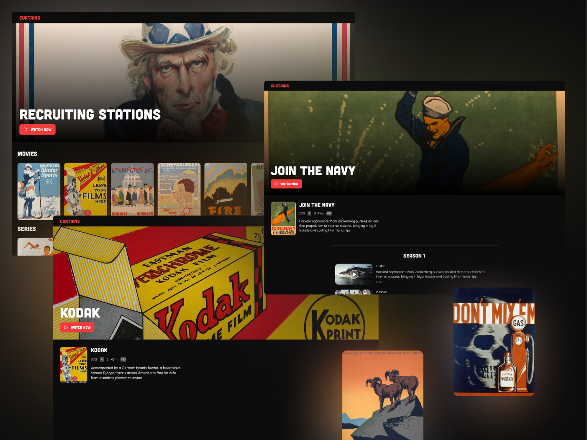

# curtains

Video streaming `🎥` front-end build using the server components of Next.js 13 `app` & Tailwind CSS.




## Getting Started

```bash
git clone https://github.com/AkashSDas/curtains.git
cd curtains
npm i
```

Add `.env.local` file inside `/curtains` & add the following env variables:

```bash
BACKEND_URL=http://localhost:3000/api
```

Start development server:

```bash
npm run dev
```
